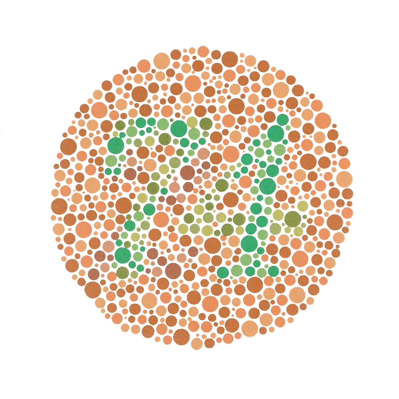

# MOAR DOTZ!
Which do you see, 21 or 74? Be care, the devil is in the details!

## Contents
  * [About](#About)
  * [Usage](#Usage)
  * [Installation](#Installation)
  * [Disclaimer](#Disclaimer)

## About
Your dot files speak volume and are a general reflection of one's personality. Some can be colorful and eccentric while others dull and plain. These are my custom dotfiles.

## Usage

Run the `./moar_dots.sh` script from the repo root. Use the `-i` (install) option to set up dotfiles and dependencies, `-r` (restore) to restore from a backup, or `-u` (uninstall) to remove an existing install. Pass `-h` or `--help` to see all options.

Example output from `./moar_dots.sh --help` (includes the rendered splash screen):

```text
 .::       .::                                .:::::                .::
 .: .::   .:::                                .::   .::             .::
 .:: .:: . .::   .::       .::    .: .:::     .::    .::   .::    .:.: .:.:::: .::
 .::  .::  .:: .::  .::  .::  .::  .::        .::    .:: .::  .::   .::       .::
 .::   .:  .::.::    .::.::   .::  .::        .::    .::.::    .::  .::     .::
 .::       .:: .::  .:: .::   .::  .::        .::   .::  .::  .::   .::    .::
 .::       .::   .::      .:: .:::.:::        .:::::       .::       .:: .::::::::

Usage: moar_dots.sh [-option]

Options:
-h  --help           Print this help message
-i  --install        Install the new configuration of dotfiles
-r  --restore        Restore dotfiles from an old configuration
-u  --unintall       Uninstall an existing version of moar_dotz
```

## Installation

## Disclaimer
> Warning: The creator of this repo is not responsible for any unwanted changes that this makes to your machine. If you are concerned at what chances will be made, please review all code before hand. Thanks!
