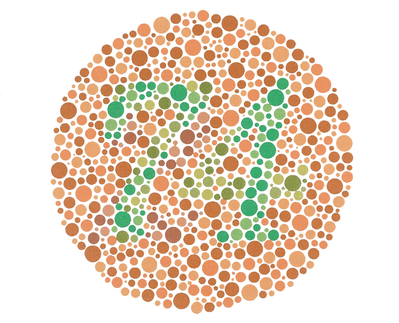

# MOAR DOTZ!
Which do you see, 21 or 74? Be care, the devil is in the details!

## Contents
---
  * [About](#About)

## About
---
Your dot files speak volume and are a general reflection of one's personality. Some can be colorful and eccentric while others dull and plain. These are my custom dotfiles.

## Installation
---

## Disclaimer
---
> Warning: The creator of this repo is not responsible for any unwanted changes that this makes to your machine. If you are concerned at what chances will be made, please review all code before hand. Thanks!
